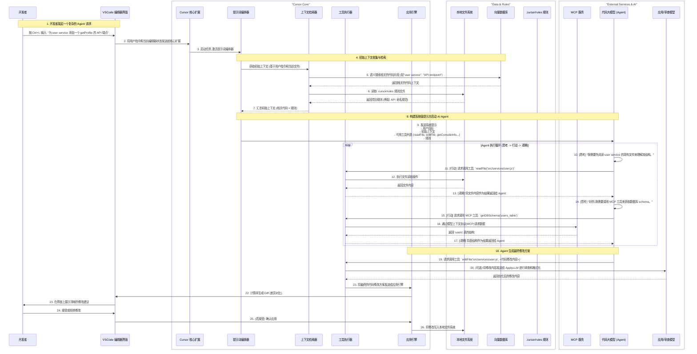

```mermaid


sequenceDiagram
    participant Developer as 开发者
    participant VSCodeUI as VSCode 编辑器界面

    box "Cursor Core"
        participant CursorExtension as Cursor 核心扩展
        participant PromptOrchestrator as 提示词编排器
        participant ContextRetriever as 上下文检索器
        participant ToolExecutor as 工具执行器
        participant ApplyEngine as 应用引擎
    end

    box "Data & Rules"
        participant Filesystem as 本地文件系统
        participant VectorDB as 向量数据库
        participant Rules as .cursor/rules 规则
    end
    
    box "External Services & AI"
        participant MCPServer as MCP 服务
        participant CodeLLM as 代码大模型 (Agent)
        participant ApplyLLM as 应用/审查模型
    end

    Note over Developer, VSCodeUI: 1. 开发者发起一个复杂的 Agent 请求
    Developer->>VSCodeUI: 按 Ctrl+I, 输入: "为 user service 添加一个 getProfile 的 API 端点"

    VSCodeUI->>CursorExtension: 2. 将用户指令和当前编辑器状态发送给核心扩展
    CursorExtension->>PromptOrchestrator: 3. 启动任务,激活提示词编排器

    Note over PromptOrchestrator, VectorDB: 4. 初始上下文收集与检索
    PromptOrchestrator->>ContextRetriever: 获取初始上下文 (基于用户指令和当前文件)
    ContextRetriever->>VectorDB: 5. 语义搜索相关的代码片段 (如"user service", "API endpoint")
    VectorDB-->>ContextRetriever: 返回相关的代码上下文
    ContextRetriever->>Filesystem: 6. 读取 .cursor/rules 规则文件
    Filesystem-->>ContextRetriever: 返回项目规则 (例如: API 命名规范)
    ContextRetriever-->>PromptOrchestrator: 7. 汇总初始上下文 (相关代码 + 规则)

    Note over PromptOrchestrator, CodeLLM: 8. 构建系统级提示并启动 AI Agent
    PromptOrchestrator->>CodeLLM: 9. 发送系统提示:<br/>- 用户目标<br/>- 初始上下文<br/>- 可用工具列表 (readFile, editFile, getConsoleInfo...)<br/>- 规则

    loop Agent 执行循环 (思考 -> 行动 -> 观察)
        CodeLLM->>CodeLLM: 10. [思考] "我需要先阅读 user service 的现有文件来理解其结构。"
        CodeLLM->>ToolExecutor: 11. [行动] 请求调用工具: `readFile('src/services/user.js')`
        
        ToolExecutor->>Filesystem: 12. 执行文件读取操作
        Filesystem-->>ToolExecutor: 返回文件内容
        ToolExecutor-->>CodeLLM: 13. [观察] 将文件内容作为结果返回给 Agent
        
        CodeLLM->>CodeLLM: 14. [思考] "好的,我需要调用 MCP 工具来获取数据库 schema。"
        CodeLLM->>ToolExecutor: 15. [行动] 请求调用 MCP 工具: `getDBSchema('users_table')`
        ToolExecutor->>MCPServer: 16. 通过模型上下文协议(MCP)请求数据
        MCPServer-->>ToolExecutor: 返回 'users' 表的结构
        ToolExecutor-->>CodeLLM: 17. [观察] 将表结构作为结果返回给 Agent
    end

    Note over CodeLLM, ApplyEngine: 18. Agent 生成最终修改方案
    CodeLLM->>ToolExecutor: 19. 请求调用工具: `editFile('src/services/user.js', <代码修改内容>)`
    
    ToolExecutor->>ApplyLLM: 20. (可选) 将修改内容发送给 ApplyLLM 进行审查和格式化
    ApplyLLM-->>ToolExecutor: 返回优化后的修改内容

    ToolExecutor->>ApplyEngine: 21. 将最终的代码修改方案发送给应用引擎
    ApplyEngine->>VSCodeUI: 22. 计算并生成 Diff (差异对比)
    VSCodeUI->>Developer: 23. 在界面上展示清晰的修改建议

    Developer->>VSCodeUI: 24. 接受或拒绝修改
    VSCodeUI->>ApplyEngine: 25. (若接受) 确认应用
    ApplyEngine->>Filesystem: 26. 将修改写入本地文件系统
```