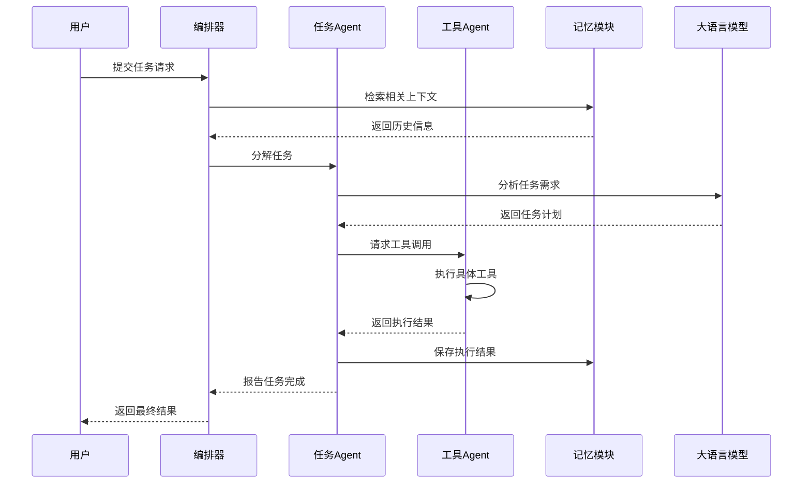
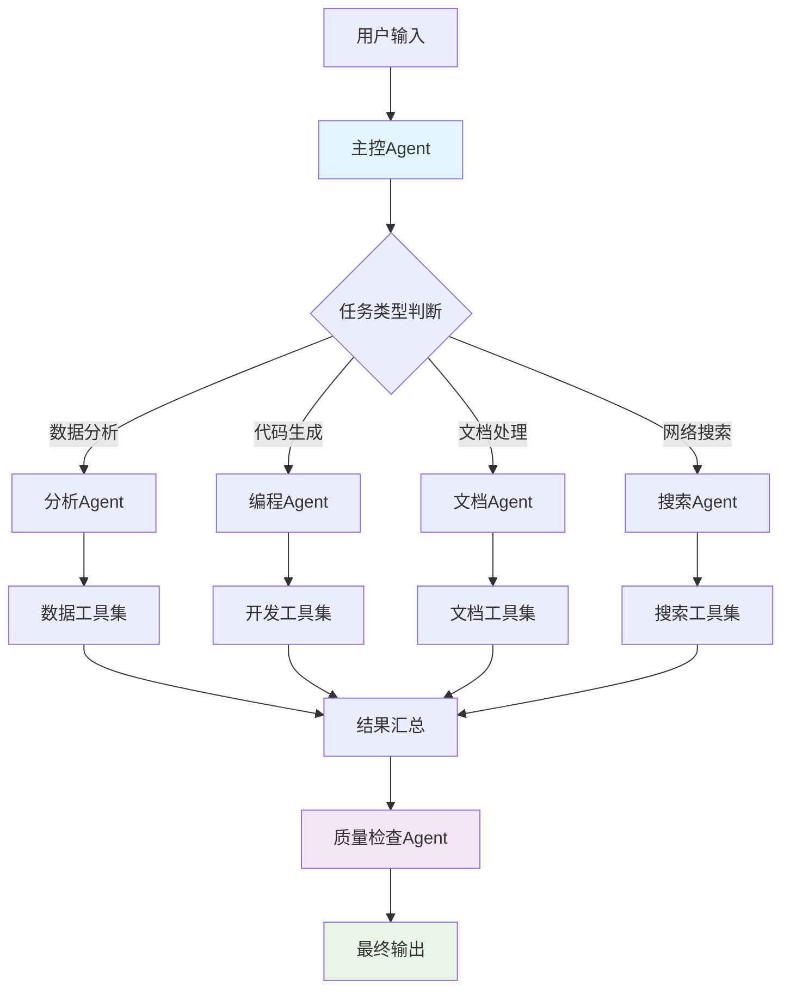
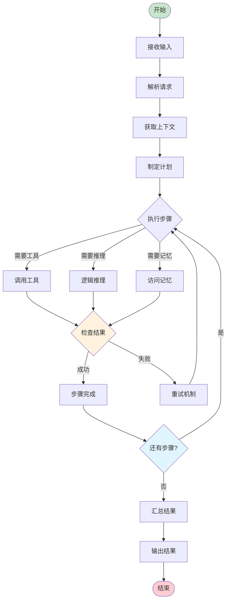
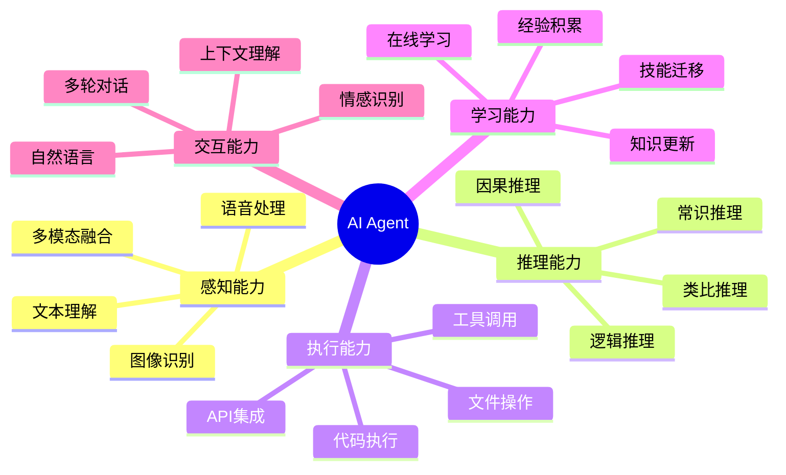

# AI Agents 架构框架

## Agent 基本交互流程

## 多 Agent 协作架构

## Agent 决策流程

## Agent 能力模型

# 学习资料

## 核心概念
- **Agent**: 具有自主性的智能实体，能够感知环境并采取行动
- **Tool**: Agent 可以调用的外部功能模块
- **Memory**: Agent 的记忆系统，存储历史信息和学习经验
- **Planning**: Agent 的任务规划和决策机制

## 技术栈
- **框架**: LangChain, CrewAI, AutoGen
- **模型**: GPT-4, Claude, Gemini
- **工具**: Function Calling, Plugin System
- **存储**: Vector DB, Graph DB, Traditional DB

## 应用场景
- 智能客服系统
- 代码助手
- 数据分析助手
- 内容创作助手
- 业务流程自动化
