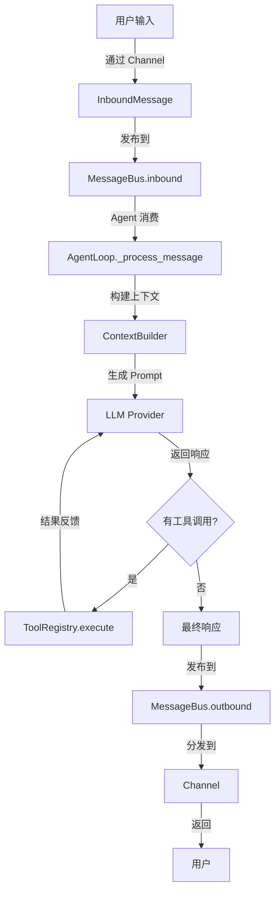

# 第一层：项目结构与架构

## 目录结构

nanobot 的目录结构非常清晰，反映了其模块化设计：

```
nanobot/
├── nanobot/              # 核心代码包
│   ├── __init__.py       # 包初始化，导出版本信息
│   ├── __main__.py       # 程序入口点
│   ├── agent/            # 🧠 核心智能体逻辑
│   │   ├── loop.py       #    Agent 主循环（LLM ↔ 工具执行）
│   │   ├── context.py    #    提示词构建器
│   │   ├── memory.py     #    持久化记忆
│   │   ├── skills.py     #    技能加载器
│   │   ├── subagent.py   #    后台子任务执行
│   │   └── tools/        #    内置工具集
│   │       ├── base.py   #      工具基类
│   │       ├── registry.py     # 工具注册表
│   │       ├── filesystem.py   # 文件系统工具
│   │       ├── shell.py        # Shell 命令执行
│   │       ├── web.py          # Web 搜索和抓取
│   │       ├── message.py      # 消息发送
│   │       └── spawn.py        # 子代理生成
│   ├── skills/           # 🎯 预置技能包（可扩展）
│   │   ├── github/       #    GitHub 集成
│   │   ├── weather/      #    天气查询
│   │   ├── tmux/         #    Tmux 管理
│   │   ├── summarize/    #    内容摘要
│   │   └── skill-creator/ #   技能创建助手
│   ├── providers/        # 🤖 LLM 提供商
│   │   ├── base.py       #    提供商基类
│   │   ├── litellm_provider.py  # LiteLLM 实现
│   │   └── transcription.py     # 语音转文字
│   ├── channels/         # 📱 多渠道集成
│   │   ├── base.py       #    渠道基类
│   │   ├── manager.py    #    渠道管理器
│   │   ├── telegram.py   #    Telegram Bot
│   │   └── whatsapp.py   #    WhatsApp 集成
│   ├── bus/              # 🚌 消息总线（解耦通信）
│   │   ├── queue.py      #    异步消息队列
│   │   └── events.py     #    消息事件定义
│   ├── session/          # 💬 会话管理
│   │   └── manager.py    #    会话状态存储
│   ├── config/           # ⚙️  配置管理
│   │   ├── schema.py     #    配置模型定义
│   │   └── loader.py     #    配置加载器
│   ├── cron/             # ⏰ 定时任务
│   │   ├── service.py    #    Cron 服务
│   │   └── types.py      #    任务类型定义
│   ├── heartbeat/        # 💓 心跳机制
│   │   └── service.py    #    主动唤醒服务
│   ├── cli/              # 🖥️  命令行接口
│   │   └── commands.py   #    所有 CLI 命令
│   └── utils/            # 🔧 工具函数
│       └── helpers.py    #    辅助函数
├── bridge/               # WhatsApp 桥接（Node.js）
├── workspace/            # 示例工作区
├── pyproject.toml        # 项目配置和依赖
├── Dockerfile            # Docker 镜像定义
└── README.md             # 项目说明文档
```

## 架构设计原则

### 1. 模块化分层
nanobot 采用经典的分层架构：

```
┌─────────────────────────────────────┐
│    用户接口层（CLI / Channels）       │
├─────────────────────────────────────┤
│    消息总线层（Message Bus）          │
├─────────────────────────────────────┤
│    智能体核心层（Agent Core）        │
├─────────────────────────────────────┤
│    工具执行层（Tools）                │
├─────────────────────────────────────┤
│    LLM 提供商层（Providers）          │
└─────────────────────────────────────┘
```

### 2. 解耦设计
- **消息总线**：channel 和 agent 通过消息队列解耦
- **工具注册表**：工具通过注册表动态加载
- **技能系统**：技能独立于核心代码，可热插拔

### 3. 异步优先
- 所有 I/O 操作都是异步的
- 使用 `asyncio` 实现并发
- 消息队列支持高吞吐量

## 核心数据流

### 完整的消息处理流程：



### 关键组件说明：

1. **InboundMessage**：封装用户输入
   - channel：消息来源（cli/telegram/whatsapp）
   - sender_id：发送者 ID
   - content：消息内容
   - media：可选的媒体附件

2. **MessageBus**：消息路由中心
   - inbound queue：待处理的用户消息
   - outbound queue：待发送的响应
   - 支持订阅-发布模式

3. **AgentLoop**：智能体核心
   - 处理消息的主循环
   - 协调 LLM 调用和工具执行
   - 管理对话历史和会话

4. **ToolRegistry**：工具管理器
   - 注册所有可用工具
   - 生成工具定义（OpenAI Function Calling 格式）
   - 执行工具调用

## 关键文件详解

### 1. `nanobot/__main__.py`
程序的真正入口点：
```python
from nanobot.cli.commands import app
if __name__ == "__main__":
    app()
```
非常简洁，直接调用 CLI 应用。

### 2. `nanobot/agent/loop.py` (~330 行)
这是整个系统的大脑，包含：
- `AgentLoop` 类：核心处理引擎
- `run()` 方法：主事件循环
- `_process_message()` 方法：单条消息处理
- 工具注册和执行逻辑

### 3. `nanobot/bus/queue.py` (~82 行)
消息总线的实现，极其简洁：
- 两个 `asyncio.Queue`：inbound 和 outbound
- 发布-订阅机制
- 异步消息分发

### 4. `nanobot/cli/commands.py` (~656 行)
所有 CLI 命令的实现：
- `onboard`：初始化配置
- `agent`：直接与 Agent 交互
- `gateway`：启动消息网关
- `cron`：定时任务管理
- 等等...

## 代码风格特点

### 1. 简洁明了
```python
# 典型的类定义 - 清晰的文档字符串
class AgentLoop:
    """
    The agent loop is the core processing engine.
    
    It:
    1. Receives messages from the bus
    2. Builds context with history, memory, skills
    3. Calls the LLM
    4. Executes tool calls
    5. Sends responses back
    """
```

### 2. 类型提示
```python
async def chat(
    self,
    messages: list[dict[str, Any]],
    tools: list[dict[str, Any]] | None = None,
    model: str | None = None,
) -> LLMResponse:
```
使用现代 Python 类型提示（Python 3.10+ 的联合类型语法）。

### 3. 异步设计
```python
async def run(self) -> None:
    """Run the agent loop, processing messages from the bus."""
    while self._running:
        msg = await self.bus.consume_inbound()
        response = await self._process_message(msg)
        await self.bus.publish_outbound(response)
```

## 依赖关系图

```
cli/commands.py
    ├── config/loader.py
    ├── bus/queue.py
    ├── agent/loop.py
    │   ├── agent/context.py
    │   │   ├── agent/memory.py
    │   │   └── agent/skills.py
    │   ├── agent/tools/*.py
    │   ├── agent/subagent.py
    │   └── session/manager.py
    ├── providers/litellm_provider.py
    └── channels/*.py
```

## 启动流程分析

当你运行 `nanobot gateway` 时，发生了什么？

```python
# 1. CLI 入口 (commands.py)
@app.command()
def gateway(port: int = 18790):
    # 2. 加载配置
    config = ConfigLoader().load()
    
    # 3. 创建核心组件
    bus = MessageBus()
    provider = LiteLLMProvider(...)
    agent = AgentLoop(bus, provider, ...)
    
    # 4. 启动渠道
    channel_manager = ChannelManager(config, bus)
    
    # 5. 运行事件循环
    async def run():
        await asyncio.gather(
            agent.run(),              # Agent 主循环
            bus.dispatch_outbound(),  # 消息分发
            channel_manager.start(),  # 渠道监听
        )
    
    asyncio.run(run())
```

## 核心设计模式

### 1. 观察者模式（Observer）
- MessageBus 的订阅-发布机制
- Channels 订阅 outbound 消息

### 2. 策略模式（Strategy）
- 不同的 LLM Provider 实现同一接口
- 不同的 Channel 实现同一接口

### 3. 注册表模式（Registry）
- ToolRegistry 管理所有工具
- 动态注册和查找

### 4. 构建器模式（Builder）
- ContextBuilder 组装复杂的提示词

## 扩展点

nanobot 设计了多个扩展点：

| 扩展点 | 位置 | 用途 |
|--------|------|------|
| **Tool** | `agent/tools/base.py` | 添加新的工具能力 |
| **Skill** | `skills/*/SKILL.md` | 添加新的技能包 |
| **Provider** | `providers/base.py` | 添加新的 LLM 提供商 |
| **Channel** | `channels/base.py` | 添加新的聊天渠道 |

## 小结

通过本章，你应该了解了：
- ✅ nanobot 的整体目录结构
- ✅ 核心架构和分层设计
- ✅ 数据流和消息处理流程
- ✅ 关键文件的作用
- ✅ 代码风格和设计模式

**下一步**：[02-CLI命令入口.md](./nanobot/2026-02-03/nanobot/02-CLI命令入口.md) - 深入了解用户如何与系统交互。
