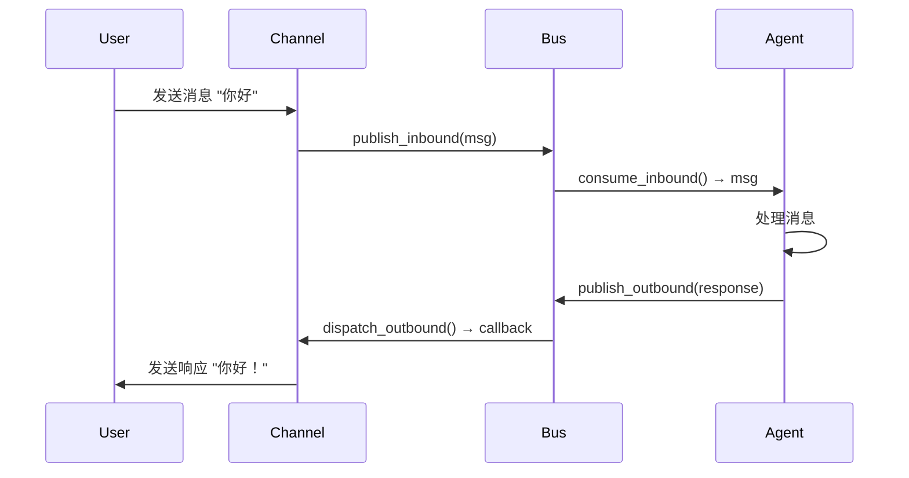

# 第二层：消息总线

> 📌 **核心文件**：  
> - `nanobot/bus/queue.py` - 消息队列实现  
> - `nanobot/bus/events.py` - 消息事件定义

## 概述

消息总线（Message Bus）是 nanobot 的核心通信层，采用**发布-订阅模式**解耦渠道（Channel）和智能体（Agent）。

## 设计理念

### 问题：紧耦合设计

如果没有消息总线，系统会是这样：

```python
# ❌ 紧耦合
class TelegramBot:
    def __init__(self, agent: AgentLoop):
        self.agent = agent  # 直接依赖 Agent
    
    async def on_message(self, msg):
        response = await self.agent.process(msg)
        await self.send(response)

# Agent 也需要知道所有渠道
class AgentLoop:
    def __init__(self, telegram: TelegramBot, whatsapp: WhatsApp):
        self.channels = [telegram, whatsapp]
```

**问题**：
- 添加新渠道需要修改 Agent 代码
- 渠道之间相互依赖
- 难以测试

### 解决方案：消息总线

```python
# ✅ 解耦设计
class TelegramBot:
    def __init__(self, bus: MessageBus):
        self.bus = bus  # 只依赖消息总线
    
    async def on_message(self, msg):
        # 发布到总线
        await self.bus.publish_inbound(msg)

class AgentLoop:
    def __init__(self, bus: MessageBus):
        self.bus = bus  # 只依赖消息总线
    
    async def run(self):
        # 从总线消费消息
        while True:
            msg = await self.bus.consume_inbound()
            response = await self.process(msg)
            await self.bus.publish_outbound(response)
```

**优势**：
- Agent 和 Channel 互不知道对方
- 添加新渠道只需订阅总线
- 易于测试（Mock MessageBus）

## 消息事件定义

### InboundMessage - 入站消息

```python
from pydantic import BaseModel

class InboundMessage(BaseModel):
    """从用户到 Agent 的消息"""
    
    channel: str           # 来源渠道：cli, telegram, whatsapp
    sender_id: str         # 发送者 ID
    chat_id: str           # 对话 ID
    content: str           # 消息内容
    session_key: str = ""  # 会话标识（默认为 channel:chat_id）
    media: list[str] = []  # 可选的媒体文件路径
    
    def __init__(self, **data):
        super().__init__(**data)
        # 自动生成 session_key
        if not self.session_key:
            self.session_key = f"{self.channel}:{self.chat_id}"
```

**示例**：
```python
msg = InboundMessage(
    channel="telegram",
    sender_id="123456789",
    chat_id="123456789",
    content="你好，帮我读取文件",
    media=["/tmp/image.jpg"]
)
```

### OutboundMessage - 出站消息

```python
class OutboundMessage(BaseModel):
    """从 Agent 到用户的响应"""
    
    channel: str      # 目标渠道
    chat_id: str      # 目标对话
    content: str      # 响应内容
    media: list[str] = []  # 可选的媒体文件
```

**示例**：
```python
response = OutboundMessage(
    channel="telegram",
    chat_id="123456789",
    content="文件内容：..."
)
```

## MessageBus 实现

### 核心结构

```python
import asyncio
from typing import Callable, Awaitable

class MessageBus:
    """异步消息总线"""
    
    def __init__(self):
        # 两个异步队列
        self.inbound: asyncio.Queue[InboundMessage] = asyncio.Queue()
        self.outbound: asyncio.Queue[OutboundMessage] = asyncio.Queue()
        
        # 出站消息订阅者：{channel: [callback1, callback2, ...]}
        self._outbound_subscribers: dict[str, list[Callable]] = {}
        
        self._running = False
```

### 入站消息处理

```python
async def publish_inbound(self, msg: InboundMessage) -> None:
    """渠道发布消息到总线"""
    await self.inbound.put(msg)

async def consume_inbound(self) -> InboundMessage:
    """Agent 从总线消费消息（阻塞直到有消息）"""
    return await self.inbound.get()
```

### 出站消息处理

```python
async def publish_outbound(self, msg: OutboundMessage) -> None:
    """Agent 发布响应到总线"""
    await self.outbound.put(msg)

def subscribe_outbound(
    self, 
    channel: str, 
    callback: Callable[[OutboundMessage], Awaitable[None]]
) -> None:
    """渠道订阅出站消息"""
    if channel not in self._outbound_subscribers:
        self._outbound_subscribers[channel] = []
    self._outbound_subscribers[channel].append(callback)

async def dispatch_outbound(self) -> None:
    """后台任务：分发出站消息到订阅者"""
    self._running = True
    while self._running:
        try:
            # 等待下一条消息
            msg = await asyncio.wait_for(self.outbound.get(), timeout=1.0)
            
            # 找到订阅者
            subscribers = self._outbound_subscribers.get(msg.channel, [])
            
            # 调用所有订阅者的回调
            for callback in subscribers:
                try:
                    await callback(msg)
                except Exception as e:
                    logger.error(f"Error dispatching to {msg.channel}: {e}")
        
        except asyncio.TimeoutError:
            continue

def stop(self):
    """停止分发循环"""
    self._running = False
```

## 完整的消息流程



## 使用示例

### 1. 在 Gateway 中使用

```python
async def main():
    # 创建总线
    bus = MessageBus()
    
    # 创建 Agent
    agent = AgentLoop(bus, provider, workspace)
    
    # 创建渠道
    telegram = TelegramChannel(config, bus)
    whatsapp = WhatsAppChannel(config, bus)
    
    # 并发运行
    await asyncio.gather(
        agent.run(),               # Agent 消费 inbound，发布 outbound
        bus.dispatch_outbound(),   # 分发 outbound 到渠道
        telegram.start(),          # Telegram 监听，发布 inbound
        whatsapp.start(),          # WhatsApp 监听，发布 inbound
    )
```

### 2. 渠道实现示例

```python
class TelegramChannel:
    def __init__(self, config, bus: MessageBus):
        self.config = config
        self.bus = bus
        self.bot = TelegramBot(config.token)
        
        # 订阅出站消息
        bus.subscribe_outbound("telegram", self.send_message)
    
    async def start(self):
        """监听 Telegram 消息"""
        @self.bot.on_message
        async def on_message(update):
            # 发布入站消息
            await self.bus.publish_inbound(InboundMessage(
                channel="telegram",
                sender_id=str(update.user.id),
                chat_id=str(update.chat.id),
                content=update.text
            ))
        
        await self.bot.run()
    
    async def send_message(self, msg: OutboundMessage):
        """发送消息回用户（订阅回调）"""
        if msg.channel == "telegram":
            await self.bot.send_message(
                chat_id=msg.chat_id,
                text=msg.content
            )
```

## 优势总结

### 1. 解耦

```python
# Agent 不需要知道渠道
class AgentLoop:
    def __init__(self, bus):
        self.bus = bus  # 只依赖抽象的总线

# 渠道不需要知道 Agent
class TelegramChannel:
    def __init__(self, bus):
        self.bus = bus  # 只依赖抽象的总线
```

### 2. 可测试

```python
async def test_agent():
    # Mock 消息总线
    bus = MessageBus()
    agent = AgentLoop(bus, mock_provider, tmp_path)
    
    # 发布测试消息
    await bus.publish_inbound(InboundMessage(
        channel="test",
        sender_id="test",
        chat_id="test",
        content="测试消息"
    ))
    
    # 验证响应
    response = await bus.consume_outbound()
    assert "期望的响应" in response.content
```

### 3. 可扩展

添加新渠道只需三步：

```python
# 1. 实现 Channel 类
class DiscordChannel:
    def __init__(self, config, bus):
        self.bus = bus
        bus.subscribe_outbound("discord", self.send_message)
    
    async def start(self):
        # 监听 Discord，发布 inbound
        pass
    
    async def send_message(self, msg):
        # 发送到 Discord
        pass

# 2. 在 gateway 中启动
discord = DiscordChannel(config, bus)

# 3. 运行
await discord.start()
```

## 性能考虑

### 队列大小

```python
# asyncio.Queue 默认无限大小
# 如果需要限制：
self.inbound = asyncio.Queue(maxsize=100)

# 当队列满时，publish_inbound 会阻塞
```

### 消息积压

```python
@property
def inbound_size(self) -> int:
    """检查积压的入站消息数"""
    return self.inbound.qsize()

@property
def outbound_size(self) -> int:
    """检查积压的出站消息数"""
    return self.outbound.qsize()

# 使用
if bus.inbound_size > 100:
    logger.warning("Too many pending messages!")
```

## 小结

- ✅ 发布-订阅模式解耦渠道和 Agent
- ✅ 异步队列支持高并发
- ✅ 简洁的实现（仅 ~80 行代码）
- ✅ 易于测试和扩展

**下一步**：[06-上下文构建.md](./nanobot/2026-02-03/06-上下文构建.md)
