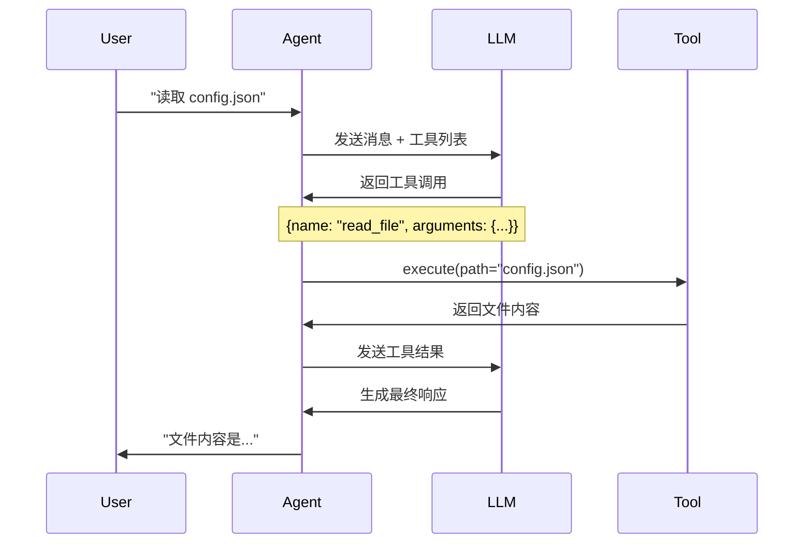

# 第四层：内置工具详解

> 📌 **核心文件**：`nanobot/agent/tools/*.py`

## 概述

nanobot 内置了 9 个核心工具，涵盖文件系统、Shell 执行、Web 操作、消息发送和子代理管理。本章详细介绍每个工具的功能、参数和使用方式。

## 文件系统工具

### 1. ReadFileTool - 读取文件

**功能**：读取文件内容

**参数**：
```json
{
  "path": "文件路径（支持 ~ 展开）"
}
```

**实现**：
```python
class ReadFileTool(Tool):
    async def execute(self, path: str) -> str:
        try:
            file_path = Path(path).expanduser()
            if not file_path.exists():
                return f"Error: File not found: {path}"
            if not file_path.is_file():
                return f"Error: Not a file: {path}"
            
            content = file_path.read_text(encoding="utf-8")
            return content
        except PermissionError:
            return f"Error: Permission denied: {path}"
        except Exception as e:
            return f"Error reading file: {str(e)}"
```

**使用示例**：

用户：**"读取 README.md 文件"**

LLM 调用：
```json
{
  "name": "read_file",
  "arguments": {"path": "README.md"}
}
```

返回：
```
# nanobot

nanobot is an ultra-lightweight personal AI assistant...
```

**特点**：
- 支持 `~` 路径自动展开
- UTF-8 编码
- 完善的错误处理（文件不存在、权限不足等）

### 2. WriteFileTool - 写入文件

**功能**：写入文件内容，自动创建父目录

**参数**：
```json
{
  "path": "文件路径",
  "content": "要写入的内容"
}
```

**实现**：
```python
class WriteFileTool(Tool):
    async def execute(self, path: str, content: str) -> str:
        try:
            file_path = Path(path).expanduser()
            # 自动创建父目录
            file_path.parent.mkdir(parents=True, exist_ok=True)
            file_path.write_text(content, encoding="utf-8")
            return f"Successfully wrote {len(content)} bytes to {path}"
        except PermissionError:
            return f"Error: Permission denied: {path}"
        except Exception as e:
            return f"Error writing file: {str(e)}"
```

**使用示例**：

用户：**"创建一个 hello.txt 文件，内容是 'Hello, World!'"**

LLM 调用：
```json
{
  "name": "write_file",
  "arguments": {
    "path": "hello.txt",
    "content": "Hello, World!"
  }
}
```

返回：
```
Successfully wrote 13 bytes to hello.txt
```

**特点**：
- 自动创建不存在的父目录
- 覆盖已有文件
- 返回写入的字节数

### 3. EditFileTool - 编辑文件

**功能**：通过文本替换编辑文件

**参数**：
```json
{
  "path": "文件路径",
  "old_text": "要替换的确切文本",
  "new_text": "新文本"
}
```

**实现**：
```python
class EditFileTool(Tool):
    async def execute(self, path: str, old_text: str, new_text: str) -> str:
        try:
            file_path = Path(path).expanduser()
            if not file_path.exists():
                return f"Error: File not found: {path}"
            
            content = file_path.read_text(encoding="utf-8")
            
            if old_text not in content:
                return f"Error: old_text not found in file. Make sure it matches exactly."
            
            # 检查唯一性
            count = content.count(old_text)
            if count > 1:
                return f"Warning: old_text appears {count} times. Please provide more context to make it unique."
            
            new_content = content.replace(old_text, new_text, 1)
            file_path.write_text(new_content, encoding="utf-8")
            
            return f"Successfully edited {path}"
        except Exception as e:
            return f"Error editing file: {str(e)}"
```

**使用示例**：

用户：**"将 config.json 中的端口从 8000 改为 9000"**

LLM 先读取文件，然后调用：
```json
{
  "name": "edit_file",
  "arguments": {
    "path": "config.json",
    "old_text": "\"port\": 8000",
    "new_text": "\"port\": 9000"
  }
}
```

**特点**：
- 精确文本匹配
- 检查唯一性（避免误替换）
- 只替换第一个匹配项

### 4. ListDirTool - 列出目录

**功能**：列出目录内容

**参数**：
```json
{
  "path": "目录路径"
}
```

**实现**：
```python
class ListDirTool(Tool):
    async def execute(self, path: str) -> str:
        try:
            dir_path = Path(path).expanduser()
            if not dir_path.exists():
                return f"Error: Directory not found: {path}"
            if not dir_path.is_dir():
                return f"Error: Not a directory: {path}"
            
            items = []
            for item in sorted(dir_path.iterdir()):
                prefix = "📁 " if item.is_dir() else "📄 "
                items.append(f"{prefix}{item.name}")
            
            if not items:
                return f"Directory {path} is empty"
            
            return "\n".join(items)
        except Exception as e:
            return f"Error listing directory: {str(e)}"
```

**返回示例**：
```
📁 nanobot
📁 docs
📄 README.md
📄 pyproject.toml
📄 LICENSE
```

## Shell 工具

### 5. ExecTool - 执行命令

**功能**：执行 Shell 命令

**参数**：
```json
{
  "command": "要执行的命令"
}
```

**实现**：
```python
class ExecTool(Tool):
    def __init__(self, working_dir: str = "."):
        self.working_dir = working_dir
    
    async def execute(self, command: str) -> str:
        try:
            process = await asyncio.create_subprocess_shell(
                command,
                stdout=asyncio.subprocess.PIPE,
                stderr=asyncio.subprocess.PIPE,
                cwd=self.working_dir
            )
            
            stdout, stderr = await process.communicate()
            
            result_parts = []
            if stdout:
                result_parts.append(f"stdout:\n{stdout.decode()}")
            if stderr:
                result_parts.append(f"stderr:\n{stderr.decode()}")
            if process.returncode != 0:
                result_parts.append(f"exit code: {process.returncode}")
            
            return "\n".join(result_parts) if result_parts else "Command executed successfully (no output)"
        except Exception as e:
            return f"Error executing command: {str(e)}"
```

**使用示例**：

用户：**"统计当前目录的 Python 文件数量"**

LLM 调用：
```json
{
  "name": "exec",
  "arguments": {"command": "find . -name '*.py' | wc -l"}
}
```

返回：
```
stdout:
42
```

**安全注意**：
- ⚠️ 可以执行任意命令，有安全风险
- 建议在受信任环境中使用
- 可以考虑添加命令白名单

## Web 工具

### 6. WebSearchTool - Web 搜索

**功能**：使用 Brave Search API 搜索网页

**参数**：
```json
{
  "query": "搜索关键词",
  "count": 5  // 可选，默认 5 条结果
}
```

**实现**：
```python
class WebSearchTool(Tool):
    def __init__(self, api_key: str | None = None):
        self.api_key = api_key
    
    async def execute(self, query: str, count: int = 5) -> str:
        if not self.api_key:
            return "Web search not configured (missing API key)"
        
        try:
            async with httpx.AsyncClient() as client:
                response = await client.get(
                    "https://api.search.brave.com/res/v1/web/search",
                    headers={"X-Subscription-Token": self.api_key},
                    params={"q": query, "count": count}
                )
                response.raise_for_status()
                
                data = response.json()
                results = data.get("web", {}).get("results", [])
                
                formatted = []
                for i, result in enumerate(results, 1):
                    formatted.append(
                        f"{i}. {result['title']}\n"
                        f"   {result['url']}\n"
                        f"   {result['description']}"
                    )
                
                return "Search results:\n\n" + "\n\n".join(formatted)
        except Exception as e:
            return f"Error searching web: {str(e)}"
```

**使用示例**：

用户：**"搜索一下 nanobot AI 的相关信息"**

LLM 调用：
```json
{
  "name": "web_search",
  "arguments": {"query": "nanobot AI assistant", "count": 3}
}
```

### 7. WebFetchTool - 抓取网页

**功能**：抓取并提取网页主要内容

**参数**：
```json
{
  "url": "网页 URL"
}
```

**实现**：
```python
from readability import Document

class WebFetchTool(Tool):
    async def execute(self, url: str) -> str:
        try:
            async with httpx.AsyncClient() as client:
                response = await client.get(url, timeout=10.0)
                response.raise_for_status()
                
                # 使用 readability 提取主要内容
                doc = Document(response.text)
                title = doc.title()
                content = doc.summary()
                
                # 简单的 HTML 转文本
                import re
                text = re.sub('<[^<]+?>', '', content)
                text = re.sub(r'\n\s*\n', '\n\n', text)
                
                return f"Page: {title}\n\n{text[:2000]}"
        except Exception as e:
            return f"Error fetching URL: {str(e)}"
```

**特点**：
- 使用 `readability-lxml` 提取主要内容
- 自动过滤广告和导航等噪音
- 限制返回长度避免超过上下文窗口

## 消息工具

### 8. MessageTool - 发送消息

**功能**：发送消息到特定渠道

**参数**：
```json
{
  "content": "消息内容",
  "to": "接收者 ID（可选）"
}
```

**实现**：
```python
class MessageTool(Tool):
    def __init__(self, send_callback):
        self.send_callback = send_callback
        self._channel = None
        self._chat_id = None
    
    def set_context(self, channel: str, chat_id: str):
        """设置当前对话上下文"""
        self._channel = channel
        self._chat_id = chat_id
    
    async def execute(self, content: str, to: str | None = None) -> str:
        target_chat_id = to or self._chat_id
        
        if not target_chat_id:
            return "Error: No recipient specified"
        
        await self.send_callback(OutboundMessage(
            channel=self._channel,
            chat_id=target_chat_id,
            content=content
        ))
        
        return f"Message sent to {target_chat_id}"
```

**使用场景**：
- 定时任务的通知
- 子代理完成后的主动消息
- 向特定用户发送提醒

**注意**：
- 普通对话不需要使用此工具，直接回复即可
- 只在需要主动发送消息时使用

## 子代理工具

### 9. SpawnTool - 生成子代理

**功能**：创建后台子代理处理长时间任务

**参数**：
```json
{
  "task": "任务描述",
  "announce": true  // 是否在完成后通知
}
```

**实现**：
```python
class SpawnTool(Tool):
    def __init__(self, manager: SubagentManager):
        self.manager = manager
        self._channel = None
        self._chat_id = None
    
    def set_context(self, channel: str, chat_id: str):
        self._channel = channel
        self._chat_id = chat_id
    
    async def execute(self, task: str, announce: bool = True) -> str:
        origin = f"{self._channel}:{self._chat_id}"
        
        subagent_id = await self.manager.spawn(
            task=task,
            origin=origin,
            announce=announce
        )
        
        return f"Spawned subagent {subagent_id} to handle: {task}"
```

**使用示例**：

用户：**"每小时检查一次网站状态"**

LLM 调用：
```json
{
  "name": "spawn",
  "arguments": {
    "task": "每小时访问 https://example.com 并检查是否在线，如果离线则通知用户",
    "announce": true
  }
}
```

子代理在后台运行，发现问题时会主动通知。

## 工具使用最佳实践

### 1. 组合使用工具

LLM 可以智能组合多个工具：

**用户**：**"找出项目中所有 TODO 注释"**

```
第 1 轮：
  LLM → list_dir(path=".")
  结果：[文件列表]

第 2 轮：
  LLM → exec(command="grep -r 'TODO' *.py")
  结果：[TODO 列表]

第 3 轮：
  LLM → 总结："找到 5 个 TODO..."
```

### 2. 错误恢复

工具失败时，LLM 会尝试其他方法：

```
尝试 1：read_file("~/config.json")
失败：Permission denied

尝试 2：exec("cat ~/config.json")
成功：返回内容
```

### 3. 渐进式操作

```
用户："备份所有配置文件"

第 1 步：list_dir查找配置文件
第 2 步：逐个 read_file
第 3 步：write_file 到备份目录
第 4 步：报告完成
```

## 工具执行流程

完整的工具调用流程：



## 性能优化

### 1. 并发执行（未来优化）

现在工具是串行执行的，可以改为并发：

```python
# 当前：串行
for tool_call in response.tool_calls:
    result = await self.tools.execute(tool_call.name, tool_call.arguments)

# 优化：并发
tasks = [
    self.tools.execute(tc.name, tc.arguments)
    for tc in response.tool_calls
]
results = await asyncio.gather(*tasks)
```

### 2. 缓存结果

```python
class CachedWebFetchTool(WebFetchTool):
    def __init__(self):
        super().__init__()
        self._cache = {}
    
    async def execute(self, url: str) -> str:
        if url in self._cache:
            return self._cache[url]
        
        result = await super().execute(url)
        self._cache[url] = result
        return result
```

## 小结

通过本章，你应该掌握了：
- ✅ 所有 9 个内置工具的功能和用法
- ✅ 工具的参数格式和返回值
- ✅ 工具组合使用的模式
- ✅ 错误处理和最佳实践

**下一步**：[10-技能系统.md](./nanobot/2026-02-03/10-技能系统.md) - 了解更灵活的技能机制。
