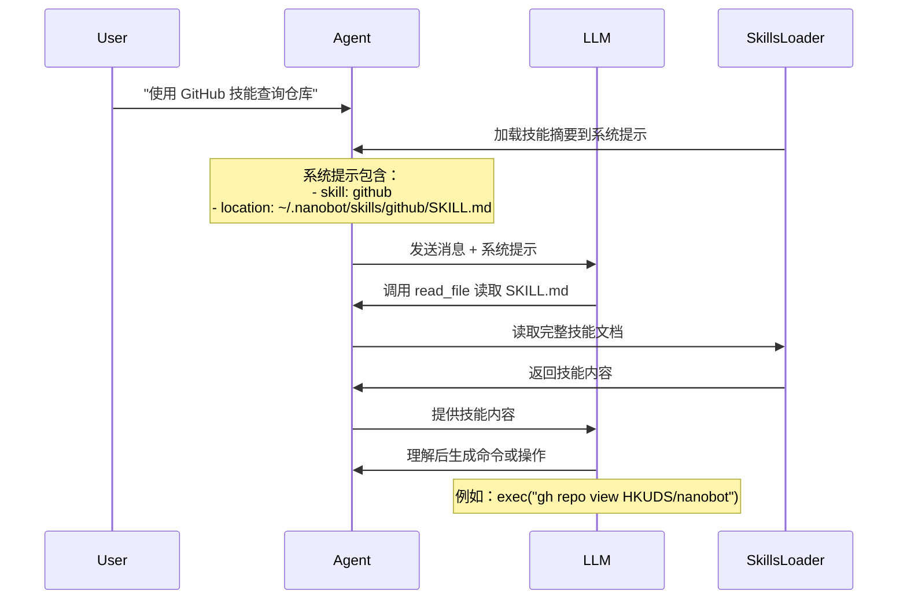

# 第五层：技能系统

> 📌 **核心文件**：`nanobot/agent/skills.py` (~229 行)  
> **技能目录**：`~/.nanobot/skills/` 和 `nanobot/skills/`

## 概述

技能（Skill）是 nanobot 的一种特殊扩展机制，与工具（Tool）互补：

| 对比维度 | 工具（Tool） | 技能（Skill） |
|---------|------------|-------------|
| **形式** | Python 代码 | Markdown 文档 + 可选脚本 |
| **调用方式** | LLM 直接调用 | LLM 读取后理解使用 |
| **灵活性** | 固定参数 | 自由文本指令 |
| **开发难度** | 需要编程 | 只需写文档 |
| **适用场景** | 明确的API调用 | 需要上下文理解的任务 |

## 技能的工作原理



**关键差异**：
- 工具：LLM 直接调用 `execute()` 方法
- 技能：LLM 先读取文档，理解后自己决定如何使用

## 技能文件结构

### 标准目录结构

```
~/.nanobot/skills/my-skill/
├── SKILL.md          # 技能定义（必需）
├── script.py         # 可选的辅助脚本
├── config.json       # 可选的配置文件
└── resources/        # 可选的资源文件
    └── template.txt
```

### SKILL.md 格式

```markdown
---
name: my-skill
description: 技能的简短描述（显示在摘要中）
available: true
---

# my-skill

完整的技能使用说明。

## 用途

这个技能用于...

## 前置要求

- 安装 `some-cli-tool`
- 设置环境变量 `API_KEY`

## 使用方法

\```bash
some-cli-tool command --arg value
\```

## 示例

当用户说 "做某某事" 时，执行：
\```bash
some-cli-tool do-something
\```

## 注意事项

- 确保先...
- 避免...
```

### Frontmatter 元数据

```yaml
---
name: github              # 技能名称（必需）
description: GitHub ops   # 简短描述
available: true           # 是否可用
always: false             # 是否始终加载（默认 false）
metadata: |               # nanobot 专有元数据（JSON）
  {
    "nanobot": {
      "requires": {
        "bins": ["gh"],         # 需要的命令行工具
        "env": ["GITHUB_TOKEN"] # 需要的环境变量
      },
      "always": false           # 优先级高于外层
    }
  }
---
```

## SkillsLoader 核心类

### 初始化

```python
class SkillsLoader:
    def __init__(self, workspace: Path, builtin_skills_dir: Path | None = None):
        self.workspace = workspace
        self.workspace_skills = workspace / "skills"     # 用户技能
        self.builtin_skills = builtin_skills_dir         # 内置技能
```

**技能优先级**：
1. 用户技能（`~/.nanobot/skills/`）
2. 内置技能（`nanobot/skills/`）

如果同名，用户技能覆盖内置技能。

### 核心方法

#### list_skills() - 列出技能

```python
def list_skills(self, filter_unavailable: bool = True) -> list[dict]:
    """
    列出所有技能
    
    Returns:
        [
            {"name": "github", "path": "...", "source": "workspace"},
            {"name": "weather", "path": "...", "source": "builtin"}
        ]
    """
```

**过滤逻辑**：
- 检查 `requires.bins` 中的命令是否存在（`shutil.which`）
- 检查 `requires.env` 中的环境变量是否设置

#### load_skill() - 加载单个技能

```python
def load_skill(self, name: str) -> str | None:
    """加载技能内容，返回完整的 SKILL.md"""
```

#### build_skills_summary() - 构建摘要

```python
def build_skills_summary(self) -> str:
    """
    生成 XML 格式的技能摘要，添加到系统提示
    
    Returns:
        <skills>
          <skill available="true">
            <name>github</name>
            <description>GitHub operations</description>
            <location>~/.nanobot/skills/github/SKILL.md</location>
          </skill>
          <skill available="false">
            <name>aws</name>
            <description>AWS operations</description>
            <location>~/.nanobot/skills/aws/SKILL.md</location>
            <requires>CLI: aws, ENV: AWS_ACCESS_KEY</requires>
          </skill>
        </skills>
    """
```

**为什么用 XML？**
- 结构化，LLM 容易解析
- 紧凑，节省 token
- 支持属性（`available`）

#### get_always_skills() - 始终加载的技能

```python
def get_always_skills(self) -> list[str]:
    """
    返回 always=true 且可用的技能列表
    这些技能的完整内容会直接加载到系统提示
    """
```

**使用场景**：
- 常用技能（如 `github`）
- 基础技能（如 `skill-creator`）

**注意**：
- 会增加系统提示长度
- 只标记最重要的技能

## 内置技能详解

### 1. github - GitHub 操作

**位置**：`nanobot/skills/github/SKILL.md`

**功能**：
- 查看仓库信息
- 列出 issues
- 创建 issue
- PR 操作
- ...

**前置要求**：
```bash
# 安装 GitHub CLI
brew install gh

# 登录
gh auth login
```

**使用示例**：

用户：**"查看 HKUDS/nanobot 仓库的最新 issues"**

LLM 理解技能后执行：
```bash
gh issue list --repo HKUDS/nanobot --limit 10
```

### 2. weather - 天气查询

**功能**：查询指定城市的天气

**前置要求**：
- 天气 API Key（如 OpenWeather）
- 环境变量 `WEATHER_API_KEY`

**使用示例**：

用户：**"北京今天天气怎么样？"**

LLM 查看技能后调用脚本：
```bash
python ~/.nanobot/skills/weather/fetch.py --city Beijing
```

### 3. tmux - Tmux 会话管理

**功能**：
- 创建/连接 tmux 会话
- 列出活动会话
- 发送命令到会话

**前置要求**：
```bash
brew install tmux
```

**使用场景**：
- 启动长时间运行的任务
- 管理多个开发环境

### 4. summarize - 内容摘要

**功能**：总结长文本或网页

**实现**：
- 使用 `read_file` 获取内容
- 使用 LLM 自身能力生成摘要

**使用示例**：

用户：**"总结这篇长文章"**

LLM：
1. 读取文章内容
2. 查看 summarize 技能的建议
3. 生成结构化摘要

### 5. skill-creator - 技能创建助手

**功能**：帮助用户创建新技能

**使用示例**：

用户：**"创建一个 Docker 技能"**

LLM 会：
1. 创建目录 `~/.nanobot/skills/docker/`
2. 生成 `SKILL.md` 模板
3. 询问用户需要的具体功能

## 技能的上下文集成

### 两种加载模式

```python
# 在 ContextBuilder 中

# 模式 1：始终加载（完整内容）
always_skills = self.skills.get_always_skills()  # ["github"]
if always_skills:
    content = self.skills.load_skills_for_context(always_skills)
    system_prompt += f"\n\n# Active Skills\n\n{content}"

# 模式 2：按需加载（仅摘要）
summary = self.skills.build_skills_summary()
if summary:
    system_prompt += f"\n\n# Available Skills\n\n{summary}"
```

### LLM 如何使用技能

```
用户消息："查看 nanobot 仓库"

系统提示包含：
  <skill available="true">
    <name>github</name>
    <location>~/.nanobot/skills/github/SKILL.md</location>
  </skill>

LLM 思考：
  "我需要查看 GitHub 仓库，有 github 技能可用"

LLM 行动 1：
  read_file(path="~/.nanobot/skills/github/SKILL.md")

返回：
  """
  # GitHub Skill
  
  使用 GitHub CLI (gh) 操作仓库。
  
  查看仓库：
  gh repo view OWNER/REPO
  """

LLM 行动 2：
  exec(command="gh repo view HKUDS/nanobot")

返回：
  [仓库信息]

LLM 响应：
  "这是 nanobot 仓库的信息：..."
```

##创建自定义技能

### 快速开始

```bash
# 1. 创建技能目录
mkdir -p ~/.nanobot/skills/my-skill

# 2. 创建 SKILL.md
cat > ~/.nanobot/skills/my-skill/SKILL.md << 'EOF'
---
name: my-skill
description: 我的自定义技能
available: true
---

# my-skill

这个技能用于...

## 使用方法

\```bash
echo "Hello from my skill!"
\```
EOF

# 3. 测试
nanobot agent -m "使用 my-skill 技能"
```

### 带脚本的技能

```python
# ~/.nanobot/skills/my-skill/script.py

#!/usr/bin/env python3
import sys
import json

def main():
    if len(sys.argv) < 2:
        print("Usage: script.py <arg>", file=sys.stderr)
        sys.exit(1)
    
    arg = sys.argv[1]
    
    # 处理逻辑
    result = {"status": "success", "data": f"Processed: {arg}"}
    
    # 输出 JSON
    print(json.dumps(result))

if __name__ == "__main__":
    main()
```

在 SKILL.md 中说明如何调用：

```markdown
## 使用方法

\```bash
python ~/.nanobot/skills/my-skill/script.py "input"
\```
```

## 最佳实践

### 1. 清晰的文档

```markdown
# ✅ 好的示例

## 使用方法

查询天气：
\```bash
curl "https://api.weather.com/v1/current?city=Beijing&key=$API_KEY"
\```

## ❌ 不好的示例

使用 weather API 获取数据
```

### 2. 具体的示例

```markdown
# ✅ 好

## 示例

当用户说 "北京天气"：
\```bash
python script.py --city Beijing
\```

输出：
\```
Temperature: 15°C
Condition: Sunny
\```
```

### 3. 错误处理说明

```markdown
## 常见问题

**Q: 提示 "API key not found"**
A: 设置环境变量：`export WEATHER_API_KEY=xxx`

**Q: 超时**
A: 检查网络连接，或增加超时时间：`--timeout 30`
```

## 技能 vs 工具的选择

```python
# 使用工具的场景
✅ 固定的 API 调用（如读文件、执行命令）
✅ 需要 Python 特定库（如 httpx、Pydantic）
✅ 复杂的数据处理逻辑

# 使用技能的场景
✅ 使用现有 CLI 工具（如 gh、aws、kubectl）
✅ 需要上下文理解的任务
✅ 快速添加新功能（无需编程）
✅ 社区贡献（只需写文档）
```

## 小结

- ✅ 技能是 Markdown 文档，易于创建和分享
- ✅ 通过系统提示集成，LLM 按需读取
- ✅ 支持渐进式加载（摘要 → 完整内容）
- ✅ 自动检测依赖（bins、env）
- ✅ 与工具互补，各有优势

**下一步**：[11-子代理系统.md](./nanobot/2026-02-03/11-子代理系统.md) - 了解后台任务处理。
