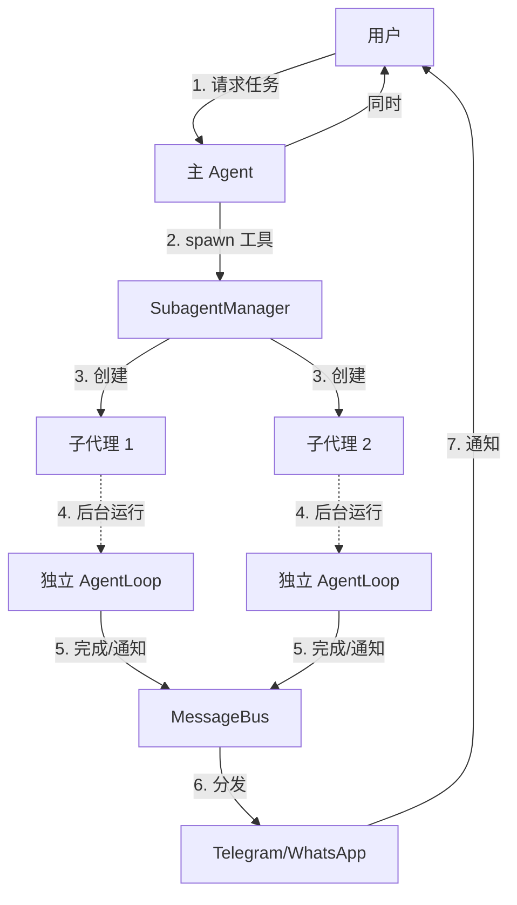

# 第五层：子代理系统

> 📌 **核心文件**：`nanobot/agent/subagent.py`

## 概述

子代理（Subagent）系统允许主 Agent 派生独立的后台 Agent 来处理长时间运行的任务，实现真正的并发处理和异步通知。

## 使用场景

### 适合子代理的任务

✅ **长时间运行**：
- 定期监控服务状态
- 等待某个事件发生
- 批量处理大量数据

✅ **异步通知**：
- 完成后主动通知用户
- 发现异常时及时警告

✅ **独立任务**：
- 不影响主对话流程
- 可以并行执行多个

### 不适合子代理的任务

❌ 需要立即结果的操作  
❌ 简单的同步任务  
❌ 需要频繁交互的任务

## 核心架构



## SubagentManager 实现

### 核心类

```python
class SubagentManager:
    """管理所有子代理"""
    
    def __init__(self, provider, workspace, bus, model, brave_api_key=None):
        self.provider = provider
        self.workspace = workspace
        self.bus = bus
        self.model = model
        self.brave_api_key = brave_api_key
        self._subagents: dict[str, asyncio.Task] = {}
    
    async def spawn(
        self,
        task: str,
        origin: str,  # 原始对话标识 "channel:chat_id"
        announce: bool = True
    ) -> str:
        """
        生成新的子代理
        
        Args:
            task: 任务描述
            origin: 完成后通知的目标
            announce: 是否在完成后通知
        
        Returns:
            子代理 ID
        """
        subagent_id = str(uuid.uuid4())[:8]
        
        # 创建独立的 AgentLoop
        subagent_loop = AgentLoop(
            bus=self.bus,
            provider=self.provider,
            workspace=self.workspace,
            model=self.model,
            brave_api_key=self.brave_api_key
        )
        
        # 在后台运行
        task_coro = self._run_subagent(
            subagent_loop,
            task,
            origin,
            announce,
            subagent_id
        )
        
        self._subagents[subagent_id] = asyncio.create_task(task_coro)
        
        logger.info(f"Spawned subagent {subagent_id} for task: {task}")
        return subagent_id
    
    async def _run_subagent(
        self,
        loop: AgentLoop,
        task: str,
        origin: str,
        announce: bool,
        subagent_id: str
    ):
        """运行子代理直到完成"""
        try:
            # 处理任务
            session_key = f"subagent:{subagent_id}"
            result = await loop.process_direct(task, session_key)
            
            # 如果需要通知
            if announce and origin:
                channel, chat_id = origin.split(":", 1)
                await self.bus.publish_outbound(OutboundMessage(
                    channel=channel,
                    chat_id=chat_id,
                    content=f"🤖 子代理 {subagent_id} 完成任务：\n\n{result}"
                ))
        
        except Exception as e:
            logger.error(f"Subagent {subagent_id} failed: {e}")
        
        finally:
            # 清理
            self._subagents.pop(subagent_id, None)
```

## SpawnTool 实现

```python
class SpawnTool(Tool):
    """生成子代理的工具"""
    
    def __init__(self, manager: SubagentManager):
        self.manager = manager
        self._channel = None
        self._chat_id = None
    
    def set_context(self, channel: str, chat_id: str):
        """设置当前对话上下文（从主 Agent 传入）"""
        self._channel = channel
        self._chat_id = chat_id
    
    @property
    def name(self) -> str:
        return "spawn"
    
    @property
    def description(self) -> str:
        return "Spawn a subagent to handle a task in the background."
    
    @property
    def parameters(self) -> dict:
        return {
            "type": "object",
            "properties": {
                "task": {
                    "type": "string",
                    "description": "任务描述"
                },
                "announce": {
                    "type": "boolean",
                    "description": "完成后是否通知用户",
                    "default": True
                }
            },
            "required": ["task"]
        }
    
    async def execute(self, task: str, announce: bool = True) -> str:
        origin = f"{self._channel}:{self._chat_id}"
        
        subagent_id = await self.manager.spawn(
            task=task,
            origin=origin,
            announce=announce
        )
        
        return f"已派生子代理 {subagent_id} 处理任务：{task}"
```

## 完整使用示例

### 场景 1：定期监控

**用户**：**"每小时检查一次 example.com 是否在线"**

```python
# 主 Agent 理解后调用
{
  "name": "spawn",
  "arguments": {
    "task": "每小时访问 https://example.com，如果返回非 200 状态码则通知我",
    "announce": true
  }
}

# 返回
"已派生子代理 a1b2c3d4 处理任务：每小时访问..."

# 子代理在后台运行
while True:
    status = await check_website("https://example.com")
    if status != 200:
        # 通过消息总线通知用户
        await bus.publish_outbound(OutboundMessage(
            channel="telegram",
            chat_id="123456",
            content=f"⚠️ 网站离线！状态码：{status}"
        ))
    await asyncio.sleep(3600)  # 等待 1 小时
```

### 场景 2：大文件处理

**用户**：**"下载并处理这个 10GB 的数据集"**

```python
# 主 Agent
{
  "name": "spawn",
  "arguments": {
    "task": "下载 https://data.example.com/dataset.zip 并解压、清洗，完成后通知我",
    "announce": true
  }
}

# 子代理独立运行
await exec("wget https://data.example.com/dataset.zip")  # 30 分钟
await exec("unzip dataset.zip")                          # 10 分钟
await exec("python clean_data.py")                       # 1 小时

# 完成后自动通知：
"🤖 子代理 x7y8z9 完成任务：
数据集已下载并清洗完成，共 1,234,567 条记录。"
```

### 场景 3：多任务并行

```python
# 用户同时发起 3 个任务

任务 1：spawn(task="监控服务器 A")
任务 2：spawn(task="监控服务器 B")
任务 3：spawn(task="每天生成报告")

# 3 个子代理同时运行，互不干扰
SubagentManager._subagents = {
    "aaa111": <Task for 任务 1>,
    "bbb222": <Task for 任务 2>,
    "ccc333": <Task for 任务 3>
}
```

## 与定时任务的对比

| 维度 | 子代理（Subagent） | 定时任务（Cron） |
|------|--------------------|------------------|
| **触发方式** | 对话中动态创建 | 预先配置 |
| **灵活性** | 高（LLM理解任务） | 低（固定消息） |
| **生命周期** | 临时（可能一次性） | 持久（周期性） |
| **复杂度** | 可以很复杂 | 通常简单 |
| **适用场景** | 临时的复杂后台任务 | 定期的简单提醒 |

## 实现细节

### 1. 独立的会话

每个子代理有独立的会话：

```python
session_key = f"subagent:{subagent_id}"
```

对话历史保存在：
```
~/.nanobot/sessions/subagent:a1b2c3d4.json
```

### 2. 共享工具和技能

子代理使用相同的：
- LLM Provider
- 工具注册表
- 技能加载器
- 工作区

### 3. 后台运行

```python
# 使用 asyncio.create_task 在后台运行
task = asyncio.create_task(self._run_subagent(...))

# 主 Agent 立即返回，不等待子代理完成
```

### 4. 通知机制

```python
# 通过消息总线发送通知
await self.bus.publish_outbound(OutboundMessage(
    channel=original_channel,
    chat_id=original_chat_id,
    content=f"子代理完成：{result}"
))

# 消息总线分发到对应渠道
# 用户收到通知
```

## 最佳实践

### 1. 明确任务目标

```markdown
# ✅ 好的任务描述
"每 30 分钟检查一次 GitHub Actions 的状态，
如果有失败的 workflow 就通知我，
并附上失败的日志链接。"

# ❌ 不好的任务描述
"监控 CI"
```

### 2. 设置终止条件

```markdown
# ✅ 有明确终止条件
"监控服务器，如果 CPU 超过 80% 连续 5 分钟则通知我，
然后停止监控。"

# ❌ 无限循环
"一直监控服务器"  # 可能永不终止
```

### 3. 合理使用 announce

```python
# 需要通知
spawn(task="下载文件", announce=True)   # 完成后通知

# 不需要通知
spawn(task="静默清理日志", announce=False)  # 后台执行即可
```

## 调试和监控

### 查看活动的子代理

```python
def list_subagents(self) -> list[str]:
    """列出所有活动的子代理 ID"""
    return list(self._subagents.keys())

# 使用
active = manager.list_subagents()
print(f"活动子代理：{active}")
```

### 停止子代理

```python
async def stop_subagent(self, subagent_id: str):
    """停止指定的子代理"""
    task = self._subagents.get(subagent_id)
    if task:
        task.cancel()
        self._subagents.pop(subagent_id)
```

### 日志记录

```python
logger.info(f"Spawned subagent {subagent_id}")
logger.info(f"Subagent {subagent_id} completed")
logger.error(f"Subagent {subagent_id} failed: {e}")
```

## 未来优化

### 1. 持久化子代理状态

当前实现在进程重启后子代理会丢失，可以改进：

```python
# 保存子代理状态到文件
{
  "id": "a1b2c3d4",
  "task": "监控服务器",
  "origin": "telegram:123456",
  "created_at": "2026-02-03T10:00:00Z",
  "status": "running"
}

# 重启后恢复
async def restore_subagents(self):
    for state in load_subagent_states():
        await self.spawn(state["task"], state["origin"])
```

### 2. 资源限制

```python
MAX_SUBAGENTS = 10

async def spawn(self, task, origin, announce=True):
    if len(self._subagents) >= MAX_SUBAGENTS:
        return "Error: 已达到最大子代理数量限制"
```

### 3. 超时控制

```python
async def _run_subagent(self, ..., timeout=3600):
    try:
        await asyncio.wait_for(
            loop.process_direct(task, session_key),
            timeout=timeout
        )
    except asyncio.TimeoutError:
        logger.warning(f"Subagent {subagent_id} timeout")
```

## 小结

- ✅ 子代理实现真正的并发后台任务
- ✅ 独立的 AgentLoop，共享资源
- ✅ 自动通知机制
- ✅ 适合长时间运行、异步通知的场景
- ✅ 与定时任务互补

**下一步**：[12-记忆系统.md](./nanobot/2026-02-03/12-记忆系统.md)
