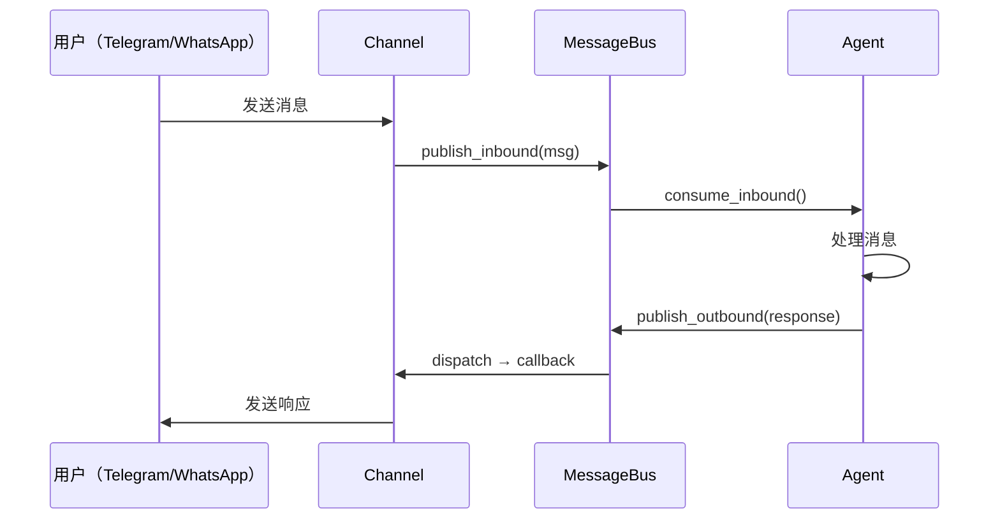

# 第六层：渠道管理

> 📌 **核心文件**：`nanobot/channels/manager.py`  
> **支持渠道**：Telegram, WhatsApp, CLI

## 概述

渠道（Channel）是 nanobot 与用户交互的前端接口。通过统一的消息总线，nanobot 可以同时支持多种聊天平台。

## Channel 抽象接口

```python
class Channel(ABC):
    """渠道抽象基类"""
    
    @abstractmethod
    async def start(self):
        """启动渠道监听"""
        pass
    
    @abstractmethod
    async def send_message(self, msg: OutboundMessage):
        """发送消息到用户"""
        pass
```

## 渠道工作流程



## 支持的渠道

### 1. Telegram Bot

**配置**：
```json
{
  "channels": {
    "telegram": {
      "enabled": true,
      "token": "123456:ABC-DEF1234ghIkl-zyx57W2v1u123ew11",
      "allowFrom": ["123456789", "987654321"]
    }
  }
}
```

**实现**：

```python
from telegram import Update
from telegram.ext import Application, MessageHandler, filters

class TelegramChannel:
    def __init__(self, config, bus: MessageBus):
        self.config = config
        self.bus = bus
        self.app = Application.builder().token(config.token).build()
        
        # 订阅出站消息
        bus.subscribe_outbound("telegram", self.send_message)
    
    async def start(self):
        """启动 Telegram Bot"""
        # 注册消息处理器
        self.app.add_handler(
            MessageHandler(filters.TEXT & ~filters.COMMAND, self.on_message)
        )
        
        # 运行
        await self.app.run_polling()
    
    async def on_message(self, update: Update, context):
        """接收 Telegram 消息"""
        user_id = str(update.effective_user.id)
        
        # 检查权限
        if self.config.allowFrom and user_id not in self.config.allowFrom:
            await update.message.reply_text("Unauthorized")
            return
        
        # 发布到消息总线
        await self.bus.publish_inbound(InboundMessage(
            channel="telegram",
            sender_id=user_id,
            chat_id=str(update.effective_chat.id),
            content=update.message.text,
            session_key=f"telegram:{update.effective_chat.id}"
        ))
    
    async def send_message(self, msg: OutboundMessage):
        """发送消息（订阅回调）"""
        if msg.channel == "telegram":
            await self.app.bot.send_message(
                chat_id=msg.chat_id,
                text=msg.content
            )
```

**特点**：
- 基于 `python-telegram-bot`
- 支持白名单（`allowFrom`）
- 自动 long polling

### 2. WhatsApp

**架构**：

```
Node.js WhatsApp库 (whatsapp-web.js)
         ↕
    WebSocket 桥接
         ↕
  Python WhatsAppChannel
         ↕
     MessageBus
```

**配置**：
```json
{
  "channels": {
    "whatsapp": {
      "enabled": true,
      "allowFrom": ["+1234567890"]
    }
  }
}
```

**Python 端实现**：

```python
class WhatsAppChannel:
    def __init__(self, config, bus: MessageBus):
        self.config = config
        self.bus = bus
        self.ws = None
        
        bus.subscribe_outbound("whatsapp", self.send_message)
    
    async def start(self):
        """连接到 Node.js 桥接"""
        async with websockets.connect("ws://localhost:8765") as ws:
            self.ws = ws
            
            async for message in ws:
                data = json.loads(message)
                
                if data["type"] == "message":
                    await self.on_whatsapp_message(data)
    
    async def on_whatsapp_message(self, data):
        sender = data["from"]
        
        # 检查权限
        if self.config.allowFrom and sender not in self.config.allowFrom:
            return
        
        await self.bus.publish_inbound(InboundMessage(
            channel="whatsapp",
            sender_id=sender,
            chat_id=sender,
            content=data["body"],
            session_key=f"whatsapp:{sender}"
        ))
    
    async def send_message(self, msg: OutboundMessage):
        if msg.channel == "whatsapp" and self.ws:
            await self.ws.send(json.dumps({
                "type": "send",
                "to": msg.chat_id,
                "message": msg.content
            }))
```

**Node.js 桥接**（简化版）：

```javascript
const { Client } = require('whatsapp-web.js');
const WebSocket = require('ws');

const client = new Client();
const wss = new WebSocket.Server({ port: 8765 });

wss.on('connection', (ws) => {
  // 接收 WhatsApp 消息
  client.on('message', (msg) => {
    ws.send(JSON.stringify({
      type: 'message',
      from: msg.from,
      body: msg.body
    }));
  });
  
  // 发送消息
  ws.on('message', (data) => {
    const cmd = JSON.parse(data);
    if (cmd.type === 'send') {
      client.sendMessage(cmd.to, cmd.message);
    }
  });
});

client.initialize();
```

### 3. CLI

CLI 不是真正的"渠道"，但实现了相同的接口：

```python
# 在 nanobot agent 命令中
response = await agent.process_direct(message, session_key)
console.print(response)
```

## ChannelManager

统一管理所有渠道：

```python
class ChannelManager:
    """渠道管理器"""
    
    def __init__(self, config, bus: MessageBus):
        self.config = config
        self.bus = bus
        self.channels = []
        
        # 初始化启用的渠道
        if config.channels.telegram and config.channels.telegram.enabled:
            self.channels.append(TelegramChannel(config.channels.telegram, bus))
        
        if config.channels.whatsapp and config.channels.whatsapp.enabled:
            self.channels.append(WhatsAppChannel(config.channels.whatsapp, bus))
    
    async def start(self):
        """并发启动所有渠道"""
        await asyncio.gather(*[ch.start() for ch in self.channels])
```

## 权限控制

### allowFrom 白名单

```json
{
  "telegram": {
    "allowFrom": ["123456", "789012"]  // 只允许这些用户
  }
}
```

**实现**：
```python
if self.config.allowFrom and user_id not in self.config.allowFrom:
    await update.message.reply_text("⛔ Unauthorized")
    return
```

### 未来扩展：角色和权限

```json
{
  "users": {
    "123456": {"role": "admin", "permissions": ["all"]},
    "789012": {"role": "user", "permissions": ["read", "execute"]}
  }
}
```

## 多渠道并发

```python
# 在 gateway 中
await asyncio.gather(
    agent.run(),
    bus.dispatch_outbound(),
    channel_manager.start(),  # 同时启动所有渠道
  cron_service.start(),
)
```

**用户体验**：
- 可以同时从 Telegram 和 WhatsApp 与 Agent 对话
- 每个渠道有独立的会话
- Agent 响应会发回原始渠道

## 添加新渠道

### 步骤

1. **实现 Channel 接口**：

```python
class DiscordChannel:
    def __init__(self, config, bus):
        self.config = config
        self.bus = bus
        bus.subscribe_outbound("discord", self.send_message)
    
    async def start(self):
        # 连接 Discord API
        # 监听消息
        # 发布到 bus
        pass
    
    async def send_message(self, msg):
        # 发送到 Discord
        pass
```

2. **添加配置**：

```json
{
  "channels": {
    "discord": {
      "enabled": true,
      "token": "discord-bot-token",
      "allowFrom": ["discord-user-id"]
    }
  }
}
```

3. **在 ChannelManager 中注册**：

```python
if config.channels.discord and config.channels.discord.enabled:
    self.channels.append(DiscordChannel(config.channels.discord, bus))
```

## 小结

- ✅ 统一的 Channel 接口
- ✅ 基于消息总线解耦
- ✅ 支持多渠道并发
- ✅ 权限控制（白名单）
- ✅ 易于扩展新渠道

**下一步**：[14-定时任务.md](./nanobot/2026-02-03/14-定时任务.md)
