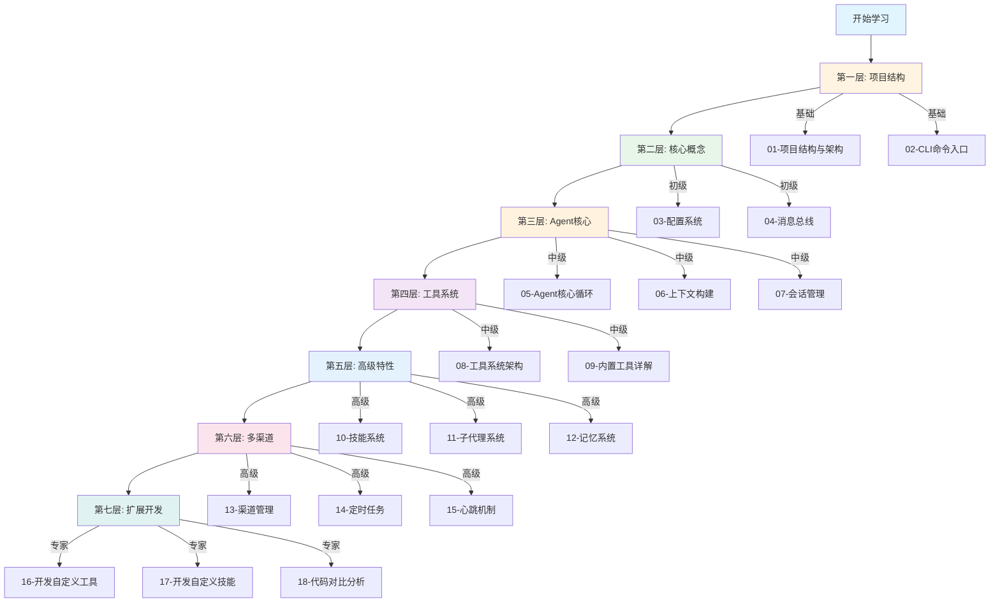
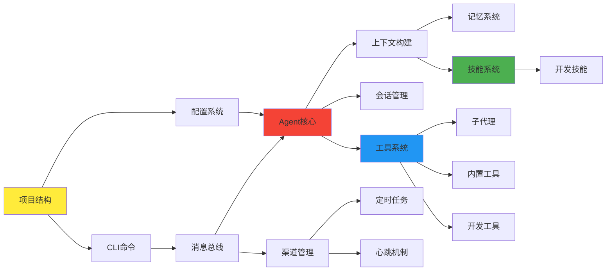
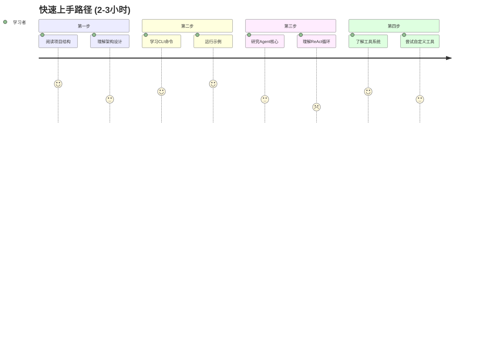
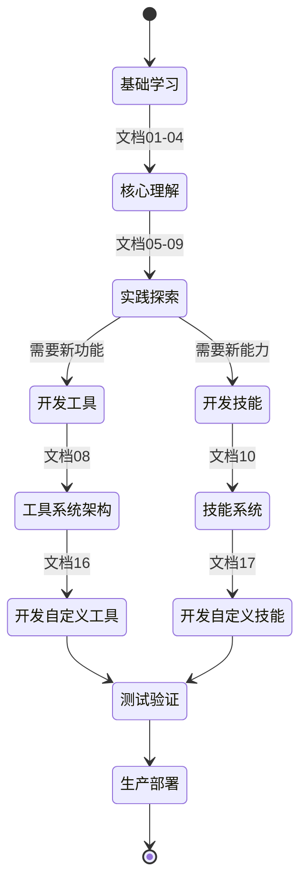
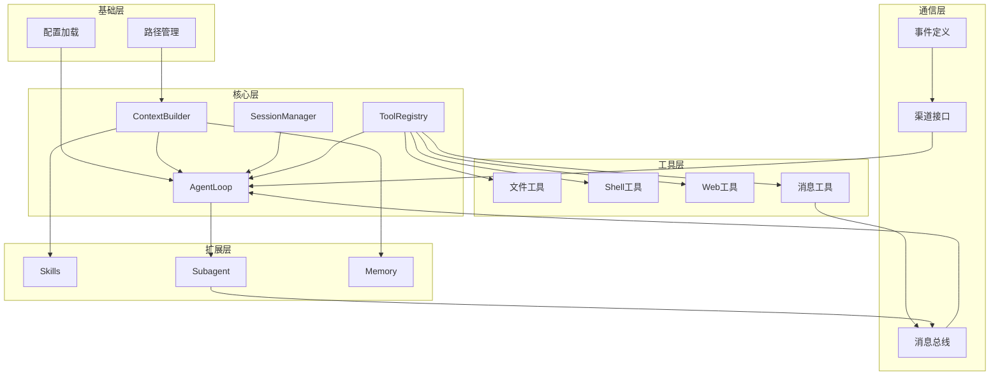

# nanobot 学习路线图

本文档提供了一个可视化的学习路线，帮助你系统地掌握 nanobot 项目。

## 整体学习架构



## 知识依赖图



## 学习路径选择

### 路径 A：快速上手（推荐新手）



**学习文档顺序**：
1. `00-学习指南总览.md` - 了解整体
2. `01-项目结构与架构.md` - 熟悉结构
3. `02-CLI命令入口.md` - 掌握使用方式
4. `05-Agent核心循环.md` - 理解核心机制
5. `08-工具系统架构.md` - 了解扩展方式

### 路径 B：系统学习（推荐研究者）

```mermaid
gantt
    title 系统学习计划 (1-2天)
    dateFormat  HH:mm
    axisFormat %H:%M
    
    section 第一天上午
    项目结构与架构     :a1, 00:00, 1h
    CLI命令入口       :a2, after a1, 1h
    配置系统         :a3, after a2, 1h
    
    section 第一天下午
    消息总线         :b1, 03:00, 1h
    Agent核心循环    :b2, after b1, 2h
    
    section 第一天晚上
    上下文构建       :c1, 06:00, 1h
    会话管理         :c2, after c1, 1h
    
    section 第二天上午
    工具系统架构     :d1, 08:00, 1.5h
    内置工具详解     :d2, after d1, 1.5h
    
    section 第二天下午
    技能系统         :e1, 11:00, 1h
    子代理系统       :e2, after e1, 1h
    记忆系统         :e3, after e2, 1h
    
    section 第二天晚上
    渠道管理         :f1, 14:00, 1h
    总结与实践       :f2, after f1, 2h
```



**学习顺序**：文档 00 → 01 → 02 → ... → 15

### 路径 C：扩展开发（推荐开发者）



**重点文档**：
1. `01-项目结构与架构.md`
2. `05-Agent核心循环.md`
3. `08-工具系统架构.md`
4. `10-技能系统.md`
5. `16-开发自定义工具.md`
6. `17-开发自定义技能.md`

## 核心概念依赖关系



## 难度等级说明

| 级别 | 说明 | 预计时间 | 适合人群 |
|------|------|---------|---------|
| 🟢 **新手** | 基础概念，无需编程背景 | 30分钟 | 所有人 |
| 🔵 **初级** | 需要基础Python知识 | 1小时 | Python初学者 |
| 🟡 **中级** | 需要异步编程概念 | 2小时 | 有经验的开发者 |
| 🟠 **高级** | 需要架构设计经验 | 3小时 | 资深开发者 |
| 🔴 **专家** | 需要深入的技术理解 | 4+小时 | 专家级开发者 |

## 各文档难度标注

```mermaid
graph LR
    subgraph 🟢 新手级
        D00[00-总览]
        D01[01-项目结构]
    end
    
    subgraph 🔵 初级
        D02[02-CLI命令]
        D03[03-配置系统]
        D04[04-消息总线]
    end
    
    subgraph 🟡 中级
        D05[05-Agent核心]
        D06[06-上下文构建]
        D07[07-会话管理]
        D08[08-工具系统]
        D09[09-内置工具]
    end
    
    subgraph 🟠 高级
        D10[10-技能系统]
        D11[11-子代理]
        D12[12-记忆系统]
        D13[13-渠道管理]
        D14[14-定时任务]
        D15[15-心跳机制]
    end
    
    subgraph 🔴 专家级
        D16[16-开发工具]
        D17[17-开发技能]
        D18[18-代码对比]
    end
```

## 实践检查点

### 检查点 1：基础理解 ✓

完成文档 00-04 后，你应该能够：
- [ ] 解释 nanobot 的整体架构
- [ ] 运行基本的 CLI 命令
- [ ] 修改配置文件
- [ ] 理解消息总线的作用

### 检查点 2：核心掌握 ✓

完成文档 05-09 后，你应该能够：
- [ ] 解释 ReAct 循环的工作原理
- [ ] 理解上下文是如何构建的
- [ ] 知道会话如何持久化
- [ ] 能够创建简单的自定义工具

### 检查点 3：高级应用 ✓

完成文档 10-15 后，你应该能够：
- [ ] 创建自己的技能包
- [ ] 使用子代理处理后台任务
- [ ] 配置多个聊天渠道
- [ ] 设置定时任务

### 检查点 4：专家级 ✓

完成文档 16-18 后，你应该能够：
- [ ] 独立开发复杂的工具
- [ ] 设计完整的技能系统
- [ ] 理解 nanobot vs Clawdbot 的权衡
- [ ] 为 nanobot 贡献代码

## 学习建议

### 📚 阅读策略
1. **第一遍**：快速浏览，了解大致内容
2. **第二遍**：仔细阅读，理解每个概念
3. **第三遍**：对照源码，验证理解

### 💻 实践方法
1. **动手操作**：每学一个概念就尝试运行相应代码
2. **修改实验**：改变参数，观察行为变化
3. **调试追踪**：使用 logger 和 debugger 追踪执行流程

### 🤝 寻求帮助
1. **查看源码**：最权威的答案在代码中
2. **阅读测试**：测试用例展示了使用方式
3. **社区讨论**：Discord / 微信群 / GitHub Issues

## 总估时

| 学习路径 | 总时长 | 覆盖内容 |
|---------|--------|---------|
| 快速上手 | 2-3 小时 | 核心概念 + 基本使用 |
| 系统学习 | 1-2 天 | 所有概念 + 深入理解 |
| 扩展开发 | 3-5 天 | 深入源码 + 实践开发 |

## 下一步

选择最适合你的学习路径，开始你的 nanobot 学习之旅！

- 🚀 [快速上手] → 从 `01-项目结构与架构.md` 开始
- 📖 [系统学习] → 按顺序阅读所有文档
- 🔧 [扩展开发] → 直接跳到 `16-开发自定义工具.md`

**记住**：最好的学习方式是边学边做！🎓
